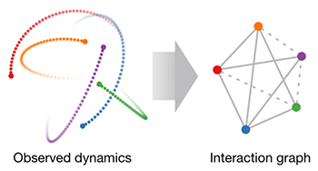

# Neural relational inference for interacting systems

This repository contains the official PyTorch implementation of:

**Neural relational inference for interacting systems.**  
Thomas Kipf*, Ethan Fetaya*, Kuan-Chieh Wang, Max Welling, Richard Zemel.  
https://arxiv.org/abs/1802.04687  (*: equal contribution)



**Abstract:** Interacting systems are prevalent in nature, from dynamical systems in physics to complex societal dynamics. The interplay of components can give rise to complex behavior, which can often be explained using a simple model of the system's constituent parts. In this work, we introduce the neural relational inference (NRI) model: an unsupervised model that learns to infer interactions while simultaneously learning the dynamics purely from observational data. Our model takes the form of a variational auto-encoder, in which the latent code represents the underlying interaction graph and the reconstruction is based on graph neural networks. In experiments on simulated physical systems, we show that our NRI model can accurately recover ground-truth interactions in an unsupervised manner. We further demonstrate that we can find an interpretable structure and predict complex dynamics in real motion capture and sports tracking data.

### Requirements
* Pytorch 0.2 (0.3 breaks simulation decoder)
* Python 2.7 or 3.6

### Data generation

To replicate the experiments on simulated physical data, first generate training, validation and test data by running:

```
cd data
python generate_dataset.py
```
This generates the springs dataset, use `--simulation charged` for charged particles.

Note: Make sure to use the same preprocessing and evaluation scripts (check the loss function as well) as in our code release to get comparable results.

### Run experiments

From the project's root folder, simply run
```
python train.py
```
to train a Neural Relational Inference (NRI) model on the springs dataset. You can specify a different dataset by modifying the `suffix` argument: `--suffix charged5` will run the model on the charged particle simulation with 5 particles (if it has been generated).

To train the encoder or decoder separately, run 

```
python train_enc.py
```
or

```
python train_dec.py
```
respectively. We provide a number of training options which are documented in the respective training files.

Additionally, we provide code for an LSTM baseline (denoted *LSTM (joint)* in the paper), which you can run as follows:
```
python lstm_baseline.py
```

### Cite
If you make use of this code in your own work, please cite our paper:
```
@article{kipf2018neural,
  title={Neural Relational Inference for Interacting Systems},
  author={Kipf, Thomas and Fetaya, Ethan and Wang, Kuan-Chieh and Welling, Max and Zemel, Richard},
  journal={arXiv preprint arXiv:1802.04687},
  year={2018}
}
```
